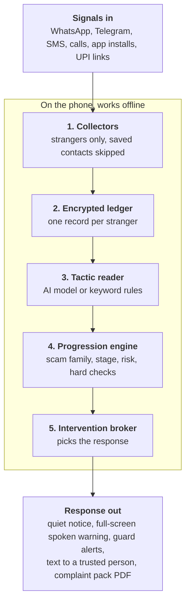

# Tripwire

**Stops the scam before the payment.**

Tripwire is on-device scam protection for Android. It follows each stranger who contacts you across WhatsApp, Telegram, SMS, calls, app installs and UPI payments. When it sees you are partway through a known scam script, it warns you at the step that can't be undone: the install, the screen share or the payment.

Everything runs on the phone. Your messages never leave it.

**Demo video:** [watch on YouTube](https://youtu.be/3qfL0g0Q4FU)

## Why

- Indians lost ₹22,495 crore to cyber fraud in 2025, and three of every four rupees were never recovered.
- A scam is not one message. It is a script that plays out over days and across apps, and each step looks harmless on its own.
- Existing tools check one message, one call or one link. No single app sees the whole sequence.

The research and market case is in [Tripwire.md](Tripwire.md). The full product spec is in [Tripwire Product Requirements Document.md](Tripwire%20Product%20Requirements%20Document.md).

## What it does

| Feature | What happens |
| --- | --- |
| Watches quietly | Keeps a private, encrypted record for each stranger. Saved contacts are skipped. |
| Tracks the stage | Each event moves the stranger along a six-stage scam script, with a risk score. |
| Warns before an install | A full-screen warning appears over Android's install screen. "Don't install" cancels it. |
| Warns before a payment | Shows the reasons, the timeline and a checkable fact, such as "not a SEBI @valid address". |
| Never blocks | You can still go ahead, but only on purpose: hold for 3 seconds. |
| Code guard | A code arrives while a stranger is on the line: "Don't share this code". The code is never read. |
| Fake credit SMS | A "money credited by mistake" SMS from a mobile number is flagged. |
| Phone checkup | Finds apps that can see or control your screen, and helps remove them. |
| Hindi and English | Warnings in your language, read aloud. |
| "I already paid" | Starts the first-hour clock, dials 1930 and your bank's fraud line, and builds a complaint pack PDF. |

## Architecture

Tripwire is one Android app with a five-step pipeline on the phone.



### The six stages

Every scam family is modelled as the same six stages. Tripwire stays silent early and warns from stage 4, where you are asked to do something you can't undo.

| # | Stage | What the scammer is doing | Tripwire |
| --- | --- | --- | --- |
| 1 | Contact | Reaches you uninvited | Silent |
| 2 | Hook | Offers a reward or creates a fear | Silent |
| 3 | Grooming | Builds trust, moves to a private chat | Quiet notice |
| 4 | Commitment | Gets a first small action: an install, a screen share | Full-screen warning |
| 5 | Extraction | Asks for the real money | Full-screen warning |
| 6 | Lock-in | Blocks withdrawal, escalates threats | Full-screen warning |

### What happens when a message arrives

1. The notification is read. If the sender is a saved contact, Tripwire stops.
2. An event is built, and phone numbers, links and UPI IDs are extracted.
3. The event is written to that stranger's encrypted ledger.
4. The tactic reader tags the message with scam tactics.
5. The progression engine updates the scam family, stage and risk.
6. If risk crosses the watch threshold, a quiet notice is posted.

### What happens at an install, screen share or payment

1. A collector reports the install, screen share or UPI link.
2. The engine finds the linked case, by entity match and then by time.
3. Hard checks run on the payment address or the app.
4. If risk is at the warn threshold, or a hard rule fires, the full-screen warning is shown.
5. The explanation is filled from stored evidence and read aloud.
6. Your choice is logged, and a text to your trusted person is prepared.

No language-model call sits on this path. It uses only stored state, so the decision is fast and predictable.

## Code layout

| Path | What it is |
| --- | --- |
| `core/` | The detection brain in plain Kotlin, with no Android dependency: entity rules, tactic tagging, the progression engine, hard checks, explanations, evidence packs and the replay harness. |
| `app/` | The Android app (Kotlin, Jetpack Compose): collectors, encrypted ledger, on-device model, warnings, screens and workers. |
| `demoapp/` | A harmless fictional "SATFIN Pro" app, used to test the install warning. |
| `tools/model/` | The tactic-reader model pipeline: dataset, LoRA training, conversion to `.litertlm`, evaluation. See [tools/model/README.md](tools/model/README.md). |
| `tools/scriptpack/`, `tools/scenarios/` | Generators for the script pack and the replay scenarios. Don't edit the generated JSON by hand. |
| `docs/` | The labelling guide and the demo video script. |
| `video/build.py` | Assembles the demo video from recordings. The recordings themselves are not in the repo. |

### Where each pipeline step lives

| Step | Code |
| --- | --- |
| Collect: notifications, calls, payment SMS | `app/.../collect/NotificationCollector.kt`, `Contacts.kt` |
| Collect: installs, payment and remote-access apps | `app/.../collect/SystemWatchers.kt`, run by `service/ProtectionService.kt` |
| Collect: UPI links | `app/.../collect/UpiLinkActivity.kt` |
| Collect: install screen (optional on-screen reading) | `app/.../collect/InstallScreenWatcher.kt` |
| Encrypted ledger | `app/.../data/Database.kt` (Room and SQLCipher, key in the Android Keystore), `RoomLedgerStore.kt` |
| Tactic reader | `core/.../tactic/`; `app/.../ai/LlmService.kt` runs LiteRT-LM in its own `:llm` process, with `LlmTacticReader.kt` as the client |
| Progression engine, hard checks, explanations | `core/.../engine/`, `core/.../checks/`, `core/.../explain/` |
| Guards | `core/.../guard/Guards.kt` |
| Warnings | `app/.../intervene/WarningActivity.kt`, `notify/Notifier.kt`, `engine/Guardian.kt` |
| Complaint pack | `core/.../evidence/`, `app/.../evidence/PackPdf.kt`, `ui/PaidScreen.kt` |
| Trusted person, updates, retention | `app/.../intervene/AllyNotifier.kt`, `app/.../work/Workers.kt` |
| Screens, onboarding, settings | `app/.../ui/` |

## The AI model

Scammers reword their messages every day, so keyword rules miss a lot, especially in Hindi and Hinglish. The tactic reader is a small language model that names the trick being used (one of 14 tactics), not the exact words.

- **Data:** 15,213 labelled messages in English, Hindi and Hinglish, both scam and everyday.
- **Training:** a LoRA fine-tune of Qwen 2.5 (0.5B) on a laptop.
- **On the phone:** one 522 MB LiteRT file, running in its own process. If it crashes, Tripwire falls back to keyword rules.
- **Safe by design:** the model can only answer in a fixed format that the app checks, so a scam message can't instruct it.

| Measure | Keyword rules | Model v3 |
| --- | --- | --- |
| Hindi F1 | 0.32 | 0.60 |
| Macro F1, all tactics | 0.57 | 0.65 |
| Scam replays caught before the payment request | 5 of 6 | 6 of 6 |
| Everyday chats given a full-screen warning | 0 of 10 | 0 of 10 |
| Everyday messages given a high-risk tag | 7.9% | 11.7% (target: under 3%) |

These are test-set results on partly synthetic data, not real-world rates. The app runs on keyword rules until the model's false-alarm rate is under 3%. Details are in [tools/model/README.md](tools/model/README.md).

## Build and test

You need JDK 17 and an Android SDK; `local.properties` points at the SDK.

```bash
JAVA_HOME=/opt/homebrew/opt/openjdk@17 ./gradlew :core:test :app:testDebugUnitTest
```

```bash
JAVA_HOME=/opt/homebrew/opt/openjdk@17 ./gradlew :app:assembleDebug
```

After changing the generator sources, regenerate the pack and the scenarios:

```bash
python3 tools/scriptpack/build_pack.py && python3 tools/scenarios/build_scenarios.py
```

## Running on a phone or emulator

Install from Android Studio or with `adb install`. Onboarding asks for each permission.

If you install from a downloaded APK file instead, Android blocks notification access at first. To allow it, open the phone's Settings → Apps → Tripwire → the three-dot menu → "Allow restricted settings", then continue onboarding.

To grant the permissions on a test device in one go:

```bash
adb shell cmd notification allow_listener com.tripwire.app/com.tripwire.app.collect.NotificationCollector && adb shell appops set com.tripwire.app GET_USAGE_STATS allow && adb shell appops set com.tripwire.app SYSTEM_ALERT_WINDOW allow
```

Useful test inputs on an emulator:
- **Scam SMS:** `adb emu sms send 9000000066 "<text>"`
- **Stranger call:** `adb emu gsm call 9000000077`, then `adb emu gsm accept 9000000077`
- **App installed from a link:** `adb install -i com.android.chrome demoapp/build/outputs/apk/debug/demoapp-debug.apk`
- **UPI link:** `adb shell am start -a android.intent.action.VIEW -d "'upi://pay?pa=x.tripwiredemo@ybl&pn=Name&am=100'"`
- **Recorded scams, no real records touched:** Settings → Demo.

**On-device model.** The app runs on keyword rules until a `.litertlm` tactic model is present. To add one, copy it to `/sdcard/Android/data/com.tripwire.app/files/models/`, then tap "Look for the model file again" in Settings. Name it `tactic-full.litertlm` on 12 GB phones and `tactic-small.litertlm` on 8 GB phones. Phones under 8 GB stay on rules. To enable an over-the-air download instead, set `tripwire.modelUrl` and `tripwire.modelSha256` as Gradle properties.

## Known limits

- **Android 15 notification redaction.** On the Android 15 emulator, the system marked every SMS as sensitive, so third-party listeners saw only "Sensitive notification content hidden". Tripwire drops these instead of storing them, but it can't read those messages.
- **Trusted-person alerts need one tap.** Tripwire holds no SMS permission and has no push backend yet, so an alert opens a pre-filled text for you to send.
- **The warning before an install needs on-screen reading.** With the optional "See the install screen" permission on, the warning appears over Android's install screen. Without it, the warning comes just after the install, with an offer to uninstall. The screen was checked on Samsung's installer; other phone makers' installers may differ.
- **The model can't run on the Apple-silicon emulator.** Every LiteRT-LM backend hits an illegal CPU instruction there. Tripwire records the crash and falls back to keyword rules. On-device inference must be verified on a real phone.
- **No WhatsApp or Telegram on the emulator.** Those parsers are covered by unit tests only, not by device tests yet.

## What's next

- Cut the model's false alarms below 3%, using real everyday chats with personal details removed and Google's larger Gemma models.
- Send trusted-person alerts by push, without a tap.
- Test on more phones: iQOO and Xiaomi installers, Telegram, and model speed on a real device.
- Before launch: real-world accuracy numbers, a DPDP legal review and the Play accessibility declaration.
